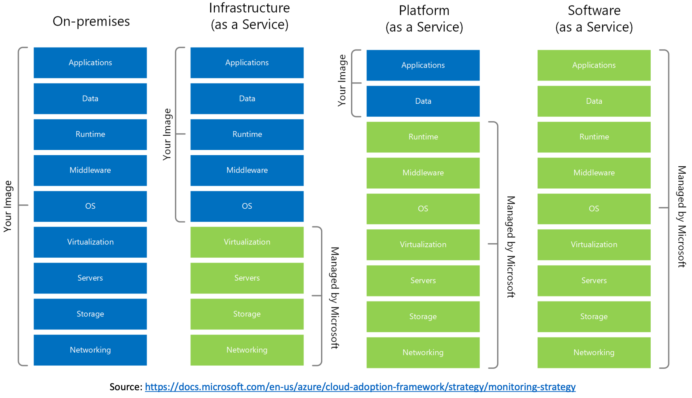

# Introduction to the Cloud
## Intro - Why Cloud? 
- 90% of software companies use the cloud. 
- Many companies believe that the future of their it is laying in the cloud and they are willing to spend a lot of money on it.
- The world is going to the cloud. 
- Being an expert in the cloud is crucial skill for every IT professional. 

## Intro - Why Microsoft Azure
- The 2nd largest public cloud
- The highest growth rate
- The most regions
- The most popular in enterprises

## Before the cloud…
If you needed a server, you had to: buy it, install it, maintain it, and replace it when it gets old. In general, you need to have an `IT team`. And the same thing happens with networking, databases, user management, and more…

## The Cloud
`Compute`, `Networking`, `Storage` and `other services` managed by `someone else`. 

## Cloud Providers
`Cloud Providers` are companies who build huge data centers, fill it with servers, networking, cooling, electricity etc, design and install various services, and make it publicly accessible. 

## Cloud Services
Clouds are huge and the competition is fierce, so they offer a lot of additional services, such as AI, IOT, Kubernetes...

In the cloud era, if you need a server, you can:
- Create it in the cloud within minutes
- Use it as you wish
- Pay for what you use
- Shut it down when not needed
- Automatically maintained, patched, secured, monitored

## Five Characteristics of Cloud Computing
### 1. On-Demand Self Service
`No human interaction` is needed for resource provisioning - Resource can be provisioned (created) with a click of a button, and provisioning is available 24/7

### 2. Broad Network Access
Resources `can be accessed from anywhere` using the network, ideally high broadband. No physical access is required at any time.

### 3. Resource Pooling
Physical resources are `shared between customers`, and the cloud’s backbone decides which physical resource to allocate for a customer’s virtual services. Some advanced cloud services allow for physical resource separation. 

### 4. Rapid Elasticity
Resources can be `scaled up and down as needed`, `automatically`. No need to purchase resources for a one-time peak scenario. 

### 5. Measured Service
- Payment is done only for resources actually used
- Server time / DB storage / Function calls etc.
- Measurement usually done in high-resolution - by the `second`
- No need to invest money in non-used resources

## CapEx vs OpEx
`CapEx (Capital Expense)` - Making upfront investment for future use / profit. It is not optimal and not flexible. 

`OpEx (Operating Expense)` - Pay for what you  actually use. It is extremely flexible, and most optimal. 

`Traditional IT` is `CapEx-oriented`, Major investment for: Building data center, purchasing servers, air conditioning, network devices, software licenses (DB etc.). There’s also `OpEx involved`: Electricity, salaries, maintenance...

## Types of Cloud Services
### IaaS (Infrastructure as a Service)
The cloud provides the `underlying platform`, compute, networking, and storage. The client handles, and is responsible for all the rest. 

The most common example of Iaas is `Virtual Machines`, where the cloud provides the host machine, networking and disks. The client creates the virtual (guest) machine, installs software on it, patches it, maintains it etc.

### PaaS (Platform as a Service)
The cloud provides `platform for running apps`, including: compute, networking, storage, runtime environment, scaling, redundancy, security, updates, patching, maintenance etc. The client just needs to `bring the code` to run. 

The most common example are `Web Apps`, where the cloud provides the runtime for running web apps, and the client uploads the code, and it just runs. The client has no access to the underlying virtual machines. 

### SaaS(Software as a Service)
It is a software running completely in the cloud. The user `doesn’t need to install anything` on-premises or on their machine. The provider of the software takes care of updates, patches, redundancy, scalability etc.

The most common example: Microsoft Office 365, Salesforce. 

## Summary
Below chart depicts the level of control we need to have on each type of resource with each type of service.

## Additional Service Types
- FaaS – Functions as a Service
- DBaaS – Database as a Service
- DaaS – Desktop as a Service
- IOTaaS – IOT as a Service
- AIaaS – AI as a Service

