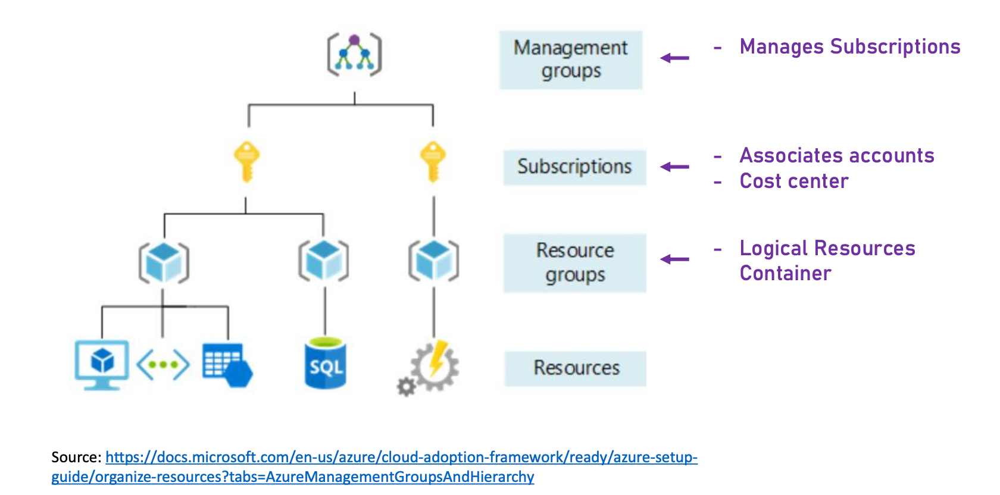

# 4. Azure Basic Concepts
## Regions
Almost every resource in Azure should be placed in a Region. 

### How to Select a Region
- Geographical proximity to system’s audience
- Services’ availability: not all services are available in all regions
- Availability Zones: Not all regions have availability zones. 
- Price. Same service can have different prices in different regions. 

## Resource Groups
Almost every resource in Azure is placed in a `Resource Group`, such as virtual machines. It is a logic container for resources used for grouping resources by a logic boundary. It is completely free. Examples for resource groups are:
- Development / Test / Production resources
- Team A, B, C's resources

### Resource Groups vs Subscriptions

### Resource Groups Naming Conventions
It’s best practice to have an “rg” or “RG” as part of the resource group name, it could be prefix or suffix: RG-Project-Dev, Finance-Resources-rg, etc. 

## Storage Accounts
Storage account is used to store almost anything in Azure. Often it is used transparently by various services to store things that user is not even aware of. For example, it can be used to store database backups, VM disks, diagostics data, etc. It is also used for explicit data storage. Storage account is extremely cheap, you can store hundres and thousands GB of data and pay only a few dollars. You can see references for storage accounts when creating various types of services. 

## SLA (Service Level Agreement)
SLA defines the uptime % of a cloud service. 

| SLA % | Yearly Downtime Allowed |
| ----------- | ----------- |
| 95 | 18d 6h 17m 27s |
| 99 | 3d 15h 39m 29s |
| 99.9 | 8h 45m 56s |
| 99.99 | 52m 35s |

When creating a new resource/service, ALWAYS check the SLA of the service used. SLA can differ based on the tier and pricing scheme. 

### SLA Calculation
To get the actual system SLA, `multiply` the SLAs of the participating services. Online tools to calculate SLA: `https://uptime.is/`

