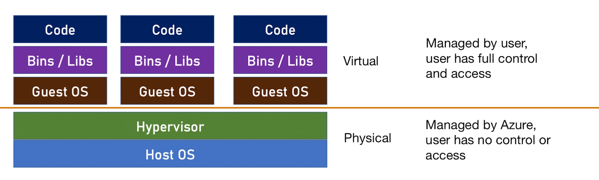

# 5. Azure Compute
`Compute` is a set of cloud services for `hosting and running applications` - it allows uploading and running your code. It offeres various levels of control and flexibility. `Iaas` and `Paas` belong to the Compute topic. 

## 🏷 Virtual Machines
Virtual machine is a `virtual server` running on a `physical server`, this allows creating new servers extremely quick, because it is based on existing resources of the physical server. From the user's point of view, VM is a regular server. VM is an `unmanaged service`, because Azure doesn't manage what happens inside the VM - it is user's responsibility. VM is a classic `IaaS` service. 

### VM Architecture


VM density: num of VMs per host. 

### Create a VM in Azure
Select the location, the image (OS + Pre-Installed software), and the size. Always check the price first. 

Note that when you create a VM in Azure, many resources will be created at the same time, such as a `network security group`, a `public IP address`, `virtual network`, `network interface` and `the actual VM`. We can see these in the Deployment details section, but it doesn't show one more resource that is also created at the same time, which is the `disk`. This is important to know, because we pay some of these resources. 

Click "Go to resource", read through the Essentials section, and note that "Virtual network/subnet: first-vm-rg-vnet/default". Click the "Connect" button at the top bar. Usually, we connect to Windows VM using RDP, and Linux VM using RDH. Select RDP here, and in the new pane, click "Download RDP File". On a mac, could download free "Microsoft Remote Desktop" app from App Store, and open the RDP file with this app. The window will open and it looks like a actual Windows Server. Now close this window, and go to Overview page of the VM in the Portal and click "Stop" button at the top bar. Note that after stopping the VM, there are still payments that might inccur, mainly for storage and sometimes the IP address. In order to make sure that we will no longer pay for anything for the resources that we just created, we need to `delete the whole resource group`, that is why we create a new resource group when we create a new VM. So in the search bar, search Resource Groups, and see a list of all rgs in the accout. Click on the rg containing VM, and click "Delete resource group" in the top bar. 

### The Real Cost of VM
- The `VM` itself
- The `disk` of the VM
- `IP` - The public IP that is exposed by the VM, the price of the IP depends on the exact type of the IP that is exposed. Not all IP/public IP addresses has a cost. 
- `Storage` - Where the image of the VM is stored. It is stored in a storage account, and we have no access to it, but we need to pay for it. The price of the storage is extremely low. 

### Reducing the Cost of VM
- `Auto Shutdown` - Automatically shuts down the machine daily at the time you choose, mainly for test / dev machines. Note that storage and IP (if static) costs still incurred. Usually can save >50% of VM cost
- `Reserved Instances` - Allow upfront payment with substantial discount. It is usually offered for 1 or 3 years, and is great for production machine which run continuously. Offers great discounts (up to 62%), and can be divided to monthly payments. Cannot be stopped / refunded
- `Spot Instances` - Machines that run on unused capacity in Azure. Can be evicted any moment when needed by Azure. Offers up to 90% discount, price fluctuates according to demand. Great for non-critical, non-continuous tasks. ie. Batch processes, long running calculations
- `Disk Optimization` - Make sure to select the right disk for the machine. Default is `Premium SSD` – the most expensive option. Non IO-intensive machines can do with `Standard SSD`. ie. App servers, in-memory cache. Note: Disk type affects the `SLA`

More Cost Saving Techniques:

- Select the right size for your machine
- CPU shouldn’t rest, you pay for it...
- Select Linux over Windows when possible to avoid license fee
- Check price in nearby regions

### SLA of VM
`https://azure.microsoft.com/en-us/support/legal/sla/virtual-machines/v1_9/`

Availability Concepts in Azure: Fault Domain, Update Domain, Availability Set, Availability Zone. 

`Fault Domain`: `Logical group of physical hardware` that share a `common power
source and network switch`. Similar to rack in a traditional data center. If there’s a problem with the power or networking in the domain (=rack) – all servers in it shut down. So you want to make sure your servers are spread
across more than one fault domain (=rack). 

`Update Domain`: `Logical group of physical hardware` that can `undergo maintenance and be rebooted at the same time`. Maintenance is done by Azure at its own discretion. If all your servers are in the same update domain, they’ll reboot at the same time during maintenance. You want to make sure your servers are spread across more than one update domain. 

`Availability Set`: `A collection of Fault Domains and Update Domains` your VMs will be spread across. It is always `in a same zone`. Can contain up to `3 Fault Domains` and up to `20 Update Domains`. `All domains (Fault & Update) are in the same Zone (=datacenter)`.

For example, if an availability set has 2 fault domains and 3 update domains, Azure will automatically spread your VMs in this availability set into separate fault and update domains. Without availability set, Azure might put these two VMs into the same fault domain, because it has no idea that these two VMs belong to the same application. 

Taking Advantage of Availability Set:

- Deploy identical VMs into t`he same Availability Set`, which ensures they won’t be shut down simultaneously when a single fault domain shuts down or an update domain reboots
- If needed – deploy `load balancer` to route between the VMs
- Availability Set is `free`, you pay only for the additional VMs

### Availability Zone
A `physically separate zone` within an `Azure region`. Technically – a building containing an autonomous data center. Provides protection against a `complete zone shutdown`. Hence the `better SLA`.

Taking Advantage of Availability Zone:

- Deploy identical VMs into `separate Availability Zones` in the same Region, which ensures they won’t be shut down simultaneously when the zone shuts down
- If needed – deploy `load balancer` to route between the VMs
- Availability Zone is `free`, you pay only for the additional VMs

Note that not all regions have availability zones. 

### VM Automation template (ARM template)
At the last stage of creating a VM in the portal, before clicking the "Create" button, click the "Download a template for automation" hyperlink. The Template page will open, and display the `ARM template (Azure Resource Manager Template)` of this VM, which is a JSON file describing the resources to be created. ARM template is used by Azure in (almost) all deployments, and can be exported, modified, uploaded, deployed; it can also be created from scratch. 

ARM Template is a `declarative` way of `deploying resources`. 

`Declarative` way describes the end result and allows “What-If” operation. It can deploy multiple resources at once. It can be integrated in CI/CD processes, and be source controlled. It is used ARM Template. 

`Imperative` way sends instructions to run. It is error prone, can’t be verified, and can’t be source controlled. It is suited for quick and dirty operations. It is used by Azure CLI, PowerShell (Although they can run ARM Template too). 

In the previous step, in the template page, it has a few tabs, including Template tab and the Parameters tab. If we click the Download button at the upper left, we will get the template as a zip file. Inside, there are two files: template.json and parameters.json. Now create a folder and copy these two files in. For the parameters.json file, you can change parameters such as osDiskType, and need to modify the value of the adminPassword field. Currently when deploy the template using the Portal, we cannot use the parameters file, it may change in the future. If we go to the Portal, and go to a list of resource groups, we can see "cloud-shell-storage-westus" rg which was automatically created when we use the cloud shell, and contains the storage account. Click on the only storage account inside this rg. In the overview page, click "File shares", and click on the single file share in the new page. Click "Add Directory", and name it "templates". Go into this dir so we can upload our templates file. Click "Upload", and select the template file and parameter file from local disk. Next, click the "Cloud Shell" button in the Portal, and use Bash. 
```
cd clouddrive
cd templates
dir
az deployment group create --resource-group [name-of-your-rg] --template-file template.json --parameters parameters.json
```

### Delete the VM
To delete the VM that was just created, go to the VM, and click the "Delete" button on the top bar. Note that in addition to this VM itself, other resources that were created at the same time, such as the OS disk, Network interfaces, Public IP addresses will also show up for selection when you click the "Delete" button. Azure asks us to select from them, because sometimes we want to use these resources with other virtual machines, or other resources. For example, we can move this disk from this virtual machine to the other. Azure do not put "Vnet" into list, because it often contain other resources, so user will not accidentally delete it. If we select all items in the list and delete, and navigate to the rg that used to contain the VM, there is only a VNet and a NSG left. Next, we can delete this rg. 

### VM Scale Set
A `VM Scale set` is `a group of separate VMs sharing the same image`, managed as a group. It can be scaled out or in `manually` or `automatically` according to predefined conditions. It is great for handling unpredictable load. 

Note that once it is set up, the machines should NOT be modified - you cannot change files, install apps etc. Because new machines created by the scale set will be based on the original image only. 

For web apps, a load balancer should be put in front of the scale set, so it exposes a single domain name, and load balancer will handle the routing to existing VMs in the scale set. 

Scale Set is free - you pay for the VMs deployed in it. 

To use VM scale set, go to the search bar in the portal, and search "scale set". In the new page, click "Add". Select the subscription, and create a new rg "vmss-rg". Name the set "my-vmss", pick a Region, and decide the Availability Zone. Pick a image and size, and create username and pwd. Then click "Review + create", then "Create". Note that in real practice, you will not create a scale set using a vanilla image of os with no app it. The default num is 2 VMs in a VMSS. When we go to the Instances page, it will show all the VMs in this VMSS. The "Scaling" page is where we decide how to scale the VMs - you can choose `"Manual scale"` or `"Custom autoscale"`. With autoscale, a policy can decide when the SS will add more instances to the current pool of VMs. Inside the policy, we can decide the min, max and default num of VMs, and a set of scaling rules. 

For example, a `scale rule` can be: when the average use of CPU is more than 80%, and it has been like this for more than 10 min, then increase the VM cnt by 1; the rule could have a cool down time of 5 min, which means after this autoscale happens, the SS will wait for 5 min before checking whether another scaling operation is needed, so the num of instances will not change too frequently. The above scale rule allows the SS to `scale out`, we can also define a scale rule that allows the SS to `sacle in`. Click "Save" after modification. If an error "Failed to update resource (missing Subscription Registration)", then this is one of the many capabilities of Azure that can only be used after got registered in your subscription. To not lose current edits, duplicate the current browser tab, in the search bar, type "subscriptions", in the new page, select our subscription, scroll down in the left pane to find "Resource Providers", it shows all services in Azure, some registered, some not. In the filer, type "insight", and find the "microsoft.insights", and click "Register" at the top bar. If webpage takes long time to update, can check status in the cloud shell: `az provider show --namespace microsoft.insights -o table`. If it shows registered, then go to the previous tab, and click "save" again, it will work. Now, the SS Instances page will show that it is deleting one instance, because the rule is working. 

Also, in the Scaling page, there is a "Scale-In Policy" tab that allows us to decide which VMs to remove when scale in happens: Default (balance availability zones and fault domain), NewestVM or OldestVM. 

### Azure Instance Metadata Services
This is a not commonly known feature. It is a `Rest API` that is accessible from the VM, and provides a lot of `info about the machine`, such as SKU, storage, networking, scheduled events, etc. This API is accessible ONLY from the VM. With scale set, `the VM gets notification from the scale set about its upcoming eviction`. And if we listen to the meta data service, we can now that an eviction is in place, and that in a few sec, the VM will be deleted. So if there are some final actions you need to run as part of this eviction, you can perform these actions. This info can be polled `every 1 min` to get enough time to close things up. 

To use this API, create a new VM with WS data center, connect to it using rdp, and wait for the Server Manager to load up, so we can configure the machine for easy web browsing. Go to Local Sever on the left pane, on the right, near "IE Enhanced Security Configuration", click the "On" hyperlink, in the pop up window, select "Off" for both Admins and Users, and save. Next open IE, and download and install Postman app. In Postman, create a new tab, use the "GET" request type, and go to Headers, set the value of "KEY" as "Metadata", and "VALUE" as "true", and the link as `http://169.254.169.254/metadata/instance?api-version=2020-06-01`. Next, click "Send" and receive various info about this VM. If we replace the url with `http://169.254.169.254/metadata/scheduledevents?api-version=2019-08-01`, we can get a list of scheduled events. 

## 🏷 App Services
`App Services` is a `fully managed web hosting for websites`, you just need to publish your code – and it just runs. You have no access to the underlying servers, it is secured and compliant by Azure. It integrates with many source controls and DevOps engines such as GitHub, BitBucket, Azure DevOps, DockerHub and more - the app is updated automatically when you upload a new verison of code on Github. 

App Services support these `platforms`: `.NET`, `.NET Core`, `Node.JS`, `Java`, `Python`, `PHP`. It also supports `containers` - if you package your app in Docker then upload it to the service, it will just run, you don't need any configurations. The app types supported are: `Web Apps`, `Web API`, `Web Jobs (batch processes)`.  

App Services are extremely easy to deploy: 

Develop you app -> create web app (can be done from IDE) -> publish your code  -> done!

### App Service Tiers
`Free` (try for free), `basic` (dedicated env for dev/test), `standard` (run production workloads), `premium` (enhanced performance and scale), `isolated` (high performance, security and isolation). For details see `https://azure.microsoft.com/en-us/pricing/details/app-service/windows/`. The `price is highly affected by the OS` you select. In general, `Linux app services are much cheaper than Windows` app services, similar to VM. The listed price is the lowest price, the price goes up with CPU & RAM selection. 

### App Serivce Auto Scaling
App Service can be `autoscaled` to support spikes in load. E.g., you can start with one instance, and if the load increases, the app service can automatically add instances, and remove them when load goes back to normal. Auto scale is based on various metric, and it is extremely flexible. The scale policy page is just like these for VM scale set. 


