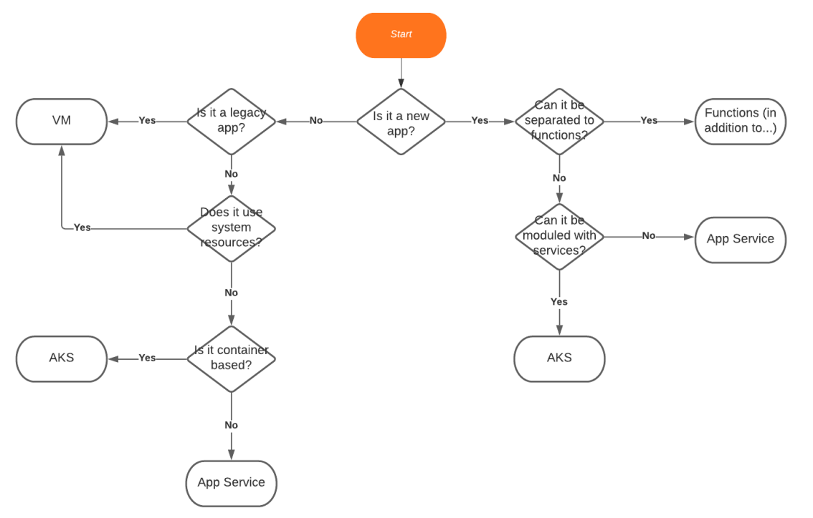

# 15. Architecting Apps for Azure
Architecting for the cloud is different than classic Software Architecture. There are two main differences: Using existing services on the cloud, and always consider cost. Azure contains hundreds of services, they are usually managed, reliable and scalable, and cost effective. Cloud architecture is cost oriented, you will sometimes go for limited services due to cost reasons - for example, using Storage Queue vs Service Bus. 

## Choosing Compute Platform

## Choosing a Data Platform
| Data Type | Used For… | Examples | Options in Azure |
| ----------- | ----------- | ----------- | ----------- |
| Relational | Structured data | Items in store, demographic data| Azure SQL, MySQL, PostgreSQL |
| NoSQL | Semi-structured data | Reviews, Log records, when flexibility is required |  Cosmos DB (with SQL, Mongo, Azure Table API) |
| Graph | Data representing relationships | Family tree | Cosmos DB (with Gremlin API) |
| Blob | Files, videos, docs | photos | Azure Blob Storage |

## 

