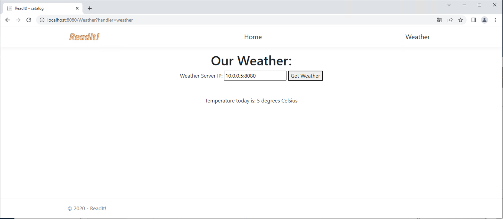
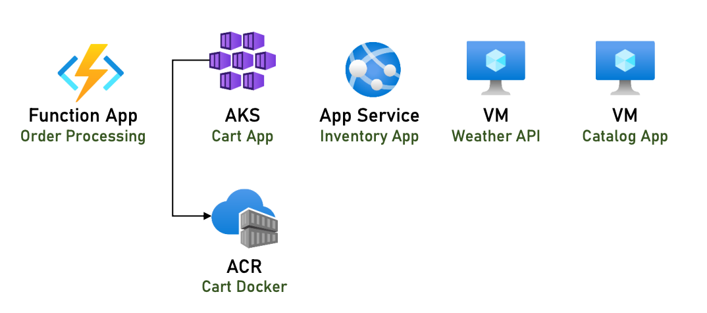

# The ReadIt App
The ReadIt App is a bookshop on the cloud, that simulates a full-blown real life bookshop. It contains 4 main services: 
- Books catalog - to pick the book you want to buy
- Shopping Cart
- Inventory Management
- Order Engine

The app starts from local and then is put to the cloud. The app is developed using .NET Core and nodeJS, and uses various databases. 

## .NET download
`https://dotnet.microsoft.com/en-us/download` to get .NET SDK 6.0 and .NET Core SDK (v3.1). Then open a new Terminal, and `dotnet --version` to check. Have problems with NuGet with M1 Mac, just ignore it. 

## VsCode and Packages
Install VSCode and the "C#", "Azure Account", "Azure App Service" package. 

## Running the Catalog Locally
Go to project folder "catalog", and `Run` -> `Start Debugging`. The catalog page will open in the browser. Note that there is no database attached to the project right now, and it is using memory.  

## Setting up the Catalog App
Open project folder in VS Code, and open its built in terminal, type `dotnet publish -o publish` and execute. There will be a new folder "publish" created in the project folder, its contents are the code to be published to the production server. 

Create a new VM named "catalog-vm" via the portal, and place in a new rg called "readit-app-rg". Set the image of the VM as Windows Server Datacenter. Select size as Standard B2ms. And use standard SSD as OS Disk type. In the Networking tab, in the Virtual network field, create a new VN and name it as readit-app-vnet. In the Public IP field, by default Azure use dynamic IP so the IP changes each time the machine starts up, but we need it to be static, so click create new, and select "Static" instead of "Dynamic", and select Basic SKU. Next, go to Management tab, and Enable auto-shutdown. Then go ahead and create the VM. 

Connect to the VM using rdp, and wait for the Server Manager to load up, so we can configure the machine for easy web browsing. Go to Local Sever on the left pane, on the right, near "IE Enhanced Security Configuration", click the "On" hyperlink, in the pop up window, select "Off" for both Admins and Users, and save. Next, go to Dashboard in the left pane, and click "Add rules and features", In the new window, click next, next, next, then in the list, select "Web Server (IIS)" role, click "Add features", next, click next on Features page, at the Role Services page, select "Custom Logging" and "Logging Tools", click next, and Confirm by clicking Install. After done, close it.  

Open web browser, go to `localhost`, and we should see IIS Window Server welcome page, which confirms that a web server is installed on this machine. I prefer to use Google Chrome. Before we can install the catalog app, we need to prepare Windows Server for dotnet core apps, by installing dotnet core. Go to `dotnet/microsoft.com/en-us/download`, and click the "All .NET 6.0 downloads" hyperlink, then on the right side, click "Hosting Bundle" for Windows. Install it. 

Next, create a new folder, so the published files of the catalog can be copied to. Open File Explorer, go to the C drive, and create a new folder named "catalog". Now go back to your local machine, go inside the "publish" folder, and copy all contents inside the publish folder, and paste it into the newly created folder in the VM. If it crashes on mac, try to paste in batches. 

The next step is to tell the web server that the catalog folder is a web app. Click on the windows button on the desktop, and type iis and open the Internet Information Services (IIS) manager. In the left pane, click the arrow on left of catalog-vm and expand it. Right click on Sites, and click "Add Website...". In the new window, type "catalog" as Site name, and select the Physical path as `C:\catalog`. In the Binding field, change the Port to 8080, and click OK. In the right section, click "Browse *:8080 (http)" hyperlink, now we have the catalog app running in the VM:


Right now, the app is accessible from the local VM, but we need to make it to be accessible from all users across the web. First go to this VM Overview page in the Portal, and find its public IP address. After appending :8080 to this IP, we find that this site is not accessible from our local machine. Closing the firewall of the VM also will not help (not recommended). The reason is that, Azure networking features automatically blocks any external access to the VM, besides the rdp port..

If we go back the VM, and in the catalog app, click "Load Books to DB", we can see a list of books available. 

## Setting up the Weather API
In the VM, in the catalog app, on the top bar, we have a Weather API, for this feature to work, we will create another VM. Go to Azure Portal, and create a new VM. Use the same rg as the catalog app. VM named "weather-vm", region same. And this time choose the Image as Ubuntu Server. Choose a smaller size such as "B1s". Select Authentication type as "Password". Use Standard SSD as disk type. For networking, we need to make sure that this VM is in the same networks as the catalog app, so Azure automatically set it as "readit-app-vnet", which is correct. Again, use static public IP for this VM. Also, in the Management tab, enable auto shutdown. 

After the VM is created, go to its overview page and find its "Public IP address", copy it, and go to Terminal in local mac, and type `ssh yourusername@vmIP`, such as `ssh lisalumos@130.1.3.78`. Note that the weather app is developed using node.js, not .net core. In the connection to remote machine, type `sudo apt install git`, `sudo apt update`, `sudo apt install nodejs`, `sudo git clone https://github.com/memilavi/weatherAPI.git`, `cd weatherAPI`, `sudo apt install npm`, `npm start`:


Go to the VM overview page, and note down the Private IP address, it is located in the lower half of the screen, under Properties tab, in the Networking section. Next, in the catalog VM in the app, enter the private ip of weather VM, followed by :8080 port number, and click Get Weather: 


Virtual Machines Tips and Tricks: 
- If your VM needs more disks, in addition to the default one provided by Azure, then go to the Disks page for that, and add whatever disk you need. Don't forget that disks have costs, and check it in the calculator beforehand.
- Want to backup your VM so that it can be restored in a case of failure? Check the Backup page, where you can define the frequency of the backup and the retention period.
- You can define DNS name for the VM, so that it will be accessible not just using its IP. This can be done by clicking the DNS Name: Configure link in the Overview page.

When not in use, we can stop the VMs so we no longer pay for it. But we still need to pay for the static public IP address. 

## Azure Architecture Diagram
When designing architecture for Azure apps it’s a good idea to use Azure symbols in the diagram, and there are hundreds of them: `https://docs.microsoft.com/en-us/azure/architecture/icons/`. 

Here is what current architecture look like:


Note that is is a back practice to allow a VM to be directly accessible from the internet so it can be rdped from anywhere. You should never leave a VM open to the internet this way. 

## Inventory App - App Service
Open the "inventory" folder in VScode, and hit F5 to start debugging, then will see the inventory app open in browser. 

To deploy this inventory app to app service, go to the portal, and search "app services", and "Create". In the new page, use "readit-app-rg" as the resource group. Unlike VM where we can pick any name we want, name of an app service is part of the app service domain itself (`.azurewebsites.net`), and has to be unique across all Azure. I name it "readit-inventory-lisa". Select Publish as Code, Runtime stack as .Net 6 (LTS), OS as Windows, and use the free F1 as size. And create. 

Go to the resource, and click the URL "https://readit-inventory-lisa.azurewebsites.net" in the overview page, can see the place holder page for the app service. Now go back to vscode, and stop running the code, and go to its built in terminal and `dotnet publish -o publish`. In the left pane in explorer view, right click the "publish" folder, and click "Deploy to Web App...". This option comes from the azure web service extension we installed earlier. Signin to Azure in the browser window that opens, and select the subscription, and click the app service "readit-inventory-lisa", and click Deploy. (For mac, need to go to vscode settings, and search Azure, and under Workspace pane, set the Deploy Subpath \ to /). Click Open the website, and will see the deployed inventory app:


To get a close look at this app service in Azure, go to the "Development Tools" section in the left pane, and click "App Service Editor (Preview)", and click "Go". This allows to edit and view the code itself. Click "Console" under the "Development Tools", which gives us a CLI into the machine that holds this app service. `dir` shows a list of the files that are deployed in the service. Under "App Service Plan" section, under the same name, shows the tier for the app service. The free tier is limited to `60 min of use per day`. The plan can be `scaled up`(manually) or `scaled out`(auto scaling, not supported for free tier) in the Settings section, and can select different plans under different tiers (dev/test, production, isolated). 

## Current Architecture


## Cart App
### Container part
Next step is to deploy the cart app into a container on Azure. Install Docker Desktop and Azure CLI using `brew update && brew install azure-cli` on the local machine. First run the app locally. Next install the Docker extension in VS code. Right click on the Dockerfile in the cart folder, and select "Build Image in Azure..."  (tag image as cart:latest and use linux platform). After build is complete, to run a new container based on this image, click the docker pane on the left bar, and under Images section, open the drop down menu near cart, and right click the "latest", and click Run. In the containers section, the container is called "cart:latest". Right click on it, and "Open in Browser" - we can see the app opens same as before. 

Next, we will create an Azure container registry, and upload the docker image to this registry. Under the Registries section, click on "Connect Registry", and select Azure. Right click on the "Azure subscription 1" in the Azure registry, and "Create Registry...", name it "readitacrlisa", and select the "Basic" tier, which will cost around 5$/month. Select resource group as "readit-app-rg", and location as "West Europe". If a message pops up as "The subscription is not registered to use namespace 'Microsoft.ContainerRegistry'", then we need to the Portal, and go to Subscriptions, then Resource providers, and search for "registry", and click "Register". Again sometimes it doesn't refresh the webpage even if it is registered, so could use `az provider show --namespace Microsoft.ContainerRegistry -o table` to check it using the cloud shell. To see the registry in the portal, search "container registries" in the search bar. 

To push the container app to Azure container registry, in  VS code, under the Images right click the "latest", and click "Push...", and select the newly created registry, and hit enter. After the push is complete, go to the portal and go to the Repositories page in the Services section, we can see the cart image. 

The next step is to create an AKS cluster and attach it to our newly created container registry, so it can pull the image from this registry. 

### AKS part
In the search bar in the Portal, search for "AKS", and click on "Kubernetes Services". Create -> Create a Kubernetes cluster. Choose the "readit-app-rg" as resource group, and the "Dev/Test($)" to save cost. For the cluster name, use "cart-aks", West Europe as Region, none availability zone, and choose "99.5%" for availability. 

When select the Node/VM size, we can see that many options shows Insufficient quota. This is because every subscription has a quota for maximum num of resources (all sorts of resources, such as num of VNs, num of vCPUs, etc) you can use. To see how many resources in the quota we have used, go to the subscription, and click on Usage + quotas in the Settings section in the left pane. Note that the number of vCPUs is in the quota is a regional number - since it is per region, we can use other regions if we reached quota for one region. We can see quotas in different regions using the filter bar on top. So select a different region for AKS, and use the D2ads_v5. Use the Manual Scale method, and use 1 as Node count. 

In the Integrations tab, and under Container registry, select the previously created registry. Review+Create -> Create. 

After the deployment is complete, go to the resource, and check the specs. 

Next step is to deploy the container into this AKS using VS code. Install the cli of AKS to we can run Kubernetes commands. In the terminal, type `sudo az aks install-cli`. Add below paths to ~/.bash_profile
```
export PATH=$PATH:/usr/local/bin/kubectl
export PATH=$PATH:/usr/local/bin
```
And `source ~/.bash_profile` in mac terminal. Test that `kubelogin` and `kubectl` commands can be found. 

Next, need to login to Azure from vscode terminal: `az login` and login from browser, then connect to the AKS cluster and get the credentials: `az aks get-credentials --resource-group readit-app-rg --name cart-aks`, and should see this returned: Merged "cart-aks" as current context in /Users/lisa/.kube/config. To see what is in the cluster: `kubectl get nodes`, then we should see:
```
NAME                                STATUS   ROLES   AGE   VERSION
aks-agentpool-17225725-vmss000000   Ready    agent   17m   v1.23.12
```

Next, open the deployment.yaml file in the cart folder. This file specifies how the cubectl to deploy containers to the Kubernetes. Change line #16 to the actual ACR for the app: `image: readitacrlisa.azurecr.io/cart:latest`. Now we are ready to deploy the container to kubernetes. In the vs code terminal, type `kubectl apply -f deployment.yaml`. The return should be:
```
deployment.apps/readit-cart created
service/readit-cart created
```

Portal -> cart-aks -> Services and ingresses under Kubernetes resources section in the left bar -> note the readit-cart service in the list. click on it -> Click on Pods in the bottom pane, it should show Ready 1/1. Now go to the external IP of the readit-cart:


## Current Architecture


## Running Functions Locally
Go to `https://learn.microsoft.com/en-us/azure/azure-functions/functions-run-local?tabs=v4%2Cmacos%2Ccsharp%2Cportal%2Cbash` and install Azure Functions Core Tools locally. Open the order folder in VS code, the ProcessOrderStorage.cs receives order details from a http request and and store it into storage. While for ProcessOrderCosmos.cs, the order details is stored in the Cosmos DB. Install Azure functions extension in vs code. Run `dotnet restore` in Terminal in vs code. Run -> Start Debugging, now can see 
```
Functions:
        ProcessOrderCosmos: [POST] http://localhost:7071/api/ProcessOrderCosmos

        ProcessOrderStorage: [POST] http://localhost:7071/api/ProcessOrderStorage
```

To test the functions, open Postman, and paste content of "ordersample.json" file as raw format in the Body section. Send a  post request to `http://localhost:7071/api/ProcessOrderCosmos`, and will see the json content display in vs code terminal. 

## Running Functions in Azure
For trial accounts, you cannot create a consumption based function app using the portal, so open cloud shell, and create a storage account by `az storage account create --name readitfuncstoragelisa --location westeurope --resource-group readit-app-rg --sku Standard_LRS`. Next, create the function app by `az functionapp create --name readitfunctionapplisa --storage-account readitfuncstoragelisa --consumption-plan-location westeurope --resource-group readit-app-rg --functions-version 4`. Next, go to the Function App page in the Portal, and should see the app called "readitfunctionapplisa". 

Now click on this function, and see that the Functions page is empty. To load a function to this function app, go to the Azure tab in vs code, and under workspace, click the cloud icon, and select "Deploy to Function App..." and click the app, and select the function app name on azure. After deployment complete, click on Upload Settings. 

Now the two functions are in the function app in Azure. You can click on the first function and go to the Code + Test pane to test it. 

## Current architecture


## Readit VNet
If we look at the two VMs that we have deployed, notice that their subnet is called default in the readit-app-vnet VNet. Recall that the catalog vm could talk with the weather vm, this is because both machines are in the same VNet. Click on this VNet in the overview page of the VM, it will bring us to the overview page of this VNet. See the address space shows: 10.0.0.0/16, which means only first two numbers are fixed, and the latter two number can be used for network devices in this VNet. If we navigate to the Connected devices page, then we can see the IP address of the two VMs: 10.0.0.4 and 10.0.0.5. If navigate to the subnet page, will see that there's a single subnet called "default", with IP range of 10.0.0.0/24, which is a subset of the VNet it belongs to. 

The Address space of the VNet can be edited by going to the Address space pane of this VNet. Also, you can create new subnets in this VNet by going into the Subnets pane. Note that for each subset, Azure reserves 5 out of its range. 

To create a new VNet, search virtual network in the portal, and click create. If this is only for testing, you can put it into a new rg, so it is easy to delete later. During the creation of VNet, you can define a few subnets inside, with different names and ranges. 

## Set up NSG for the Catalog VM
Start this VM so could test it later. Go to the "Networking" pane, the list of Inbound port rules and Outbound port rules shows the NSG rules that are attached to this VM. It also shows that the NSG attached to this VM impacts 0 subnets, and 1 network interfaces (this VM). By default, Azure creates 4 rules in this NSG from slow priority to top priority: DenyAllInBound, AllowAzureLoadBalancerInBound, AllowVnetInBound (allows peering from other vnets in Azure), RDP (currently allows all traffic in). Click on the RDP rule to edit it. To get your current IP, just Google it. For the Source field, select IP Addresses, and in the Source IP addresses field, type your current IP. And click save. 

Recall that we cannot connect to the catalog VM from another machine. This is because there is no NSG rule that specifies allowing connection to 8080 port. To allow anyone (customers) to browse to this port, Click Add Inbound port rule, note that Azure automatically adds 8080 to the Destination port ranges field. Select only TCP as the Protocol, and add description in the Description field as "Allows browsing to the catalog app", and save. Now copy the public IP of this VM, and append :8080 to it, and open it in browser. Now we can see the catalog app from other than the VM. 

## Set up NSG for the Weather API
Perform the same steps for modifying the current SSH rule to it only accessible from your IP address. 

## Move the Weather API to a new subnet
Navigate to the weather-vm, and click on its VNet, and go to the subsets pane, and create a new Subnet. Name: weather-subnet, Network security group: leave it empty (Note in the dropdown menu, weather-vm-nsg is the one that we modified in the previous session. It was created automatically when this VM was created). Click save. 

The next step is to move the weather VM into this newly created subnet. Go to the Networking pane in the weather-vm, and click on the name of the Network Interface. Go to the IP configurations pane under Settings, and select the new subnet in the Subnet dropdown list. Note that the vm will restart if we change the subnet that it lives in. Click Save. 

To create a new nsg to attach to the new subnet, in the portal, search networks security group. Click Add. Resource group: readit-app-rg, Name: weather-subnet-nsg, Region: west europe. And create. Go to this resource, navigate to the Inbound security rules, see that there's no ssh rule attached to this nsg by default, this is because this nsg is not created during the creation of a linux vm. Navigate to the Subnets pane, click Associate, and select readit-app-vnet as the Virtual network, and then the weather-subnet as the Subnet. Hit Ok.  

Next, add SSH allowing nsg rule into this nsg, so we could ssh to the VM inside the subnet. This is because although the nsg of the vm allows ssh, but the nsg of the subnet that the vm lives in doesn't allow ssh. Click Add, Source: IP Address, Source IP addresses/CIDR ranges: (your IP), Destination port ranges: 22, Protocol: TCP, Name: SSH. Click Add. 

## Move the Weather API to a new VNet
Create a new VNet, note should not overlap with the address space of the current vnet. Go to Virtual Networks page in the Portal and click Create. Resource group: readit-app-rg, Name: weather-vnet, Region: west-europe. Go to the IP Addresses pane in the create page, and can see that the IPv4 address space that Azure shows there is not overlapped with the existing vnets. Modify the name of the default subnet to weather-subnet. Click Create. 

Next, need to move the weather API to this new VNet. Recall that to move the vm from one subnet to another, it was a lot easier - you just select this subnet. But moving a vm from one vnet to another is more complicated - we need to delete the weather VM and create it in the new vnet. 

Go to the weather vm, and click Delete. In the delete page, uncheck OS disk (so it can be used as the base for a new VM), check Network interfaces and Public IP addresses to delete both of them. Click Delete. 

In the portal, search disks, we can see the weather-vm disk1 has no Owner, while our catalog-vm disk is attached to the catalog-vm as Owner. Click on the weather-vm disk, and click Create VM. In the Create VM page, note that the Image field is already pre-populated with this disk. Virtual machine name: weather-vm, go to the Disks pane, note you cannot change OS disk type this time, because it already exists. In the Networking pane, Virtual network: weather-vnet, subnet: (defaulted to the only subnet in this vnet), Public IP: (note that catalog vm is connecting to weather vm using Azure network, not using the public IP. But we still need it to have a Public IP because we need to ssh to this machine to start the weather api) so create a public IP, and SKU: Basic, Assignment: Static. In the Management pane, Enable auto-shutdown: check, Notification before shutdown: uncheck. And Create. Note that Azure didn't ask us the credentials for this machine, this is because these credentials are already stored in the disk. 

Go to Resource, in the Overview page, see that the Virtual network/subnet: weather-vnet/weather-subnet. Go to the Networking pane, and modify the SSH rule to allow your IP only. Copy the public IP of this VM, and ssh to it and start the weather API. 

Now if we start the catalog vm and open the catalog app using its public IP, and go to the Weather page, and put in the weather vm private IP appending :8080, we cannot reach the weather API - because the two vms live in different vnets now. 

## Peering of the two vnets
Under the Networking pane of weather vm, click the hyperlink in network/subnet: weather-vnet/weather-subnet to go to the virtual network page. Go to the Peerings pane, click Add. This virtual network: Peering link name: readit-peering, Remote virtual network: Peering link name: weather-peering, Virtual network: readit-app-vnet. Click Add. Can see that Azure is adding two peerings, one from weather-vnet to readit-app-vnet, and one vise versa. 

Now if we start the catalog vm and open the catalog app using its public IP, and go to the Weather page, and put in the weather vm private IP appending :8080, we can reach the weather API. 

Just by defining the peering, the connection now works. We wonder why the NSGs did not block this connection. Go to the Networking pane of the weather vm, see that there is a rule called AllowVnetInBound - a default rule that allow traffic from VNets in Azure. 

As a test, to prevent anyone to use this VM at port 8080, click Add inbound port rule, Action: Deny. Click Save. Verify that is did prevent using weather API even from catalog VM. What we really want is to only allow traffic from this catalog vm, and block all the rest. Click on the rule we just created, and Source: IP Addresses, Source IP addresses/CIDR ranges: private IP of catalog vm, Action: Allow, Protocol: TCP, Description: Allow catalog VM to access the weather API. Hit Save. 

## Current Architecture


## Add Bastion to the catalog-vm
Search for bastion in the portal, and click Create Bastion. Resource group: readit-app-rg, Name: readit-bastion, Region: West Europe, Virtual network: readit-app-vnet, Subnet: (create a new subnet called AzureBastionSubnet). Create. This creates two resources: the bastion itself, and its public IP address. 

Go to the catalog-vm, in the Networking pane, Delete the nsg rule for RDP. In the Connect pane, select the BASTION tab, click Use Bastion. Type in the Username and Password for the VM login, and click Connect, now can see the vm screen open in the webpage in a new tab. This useful if we want to connect to VM but want to keep rdp/ssh port closed. 

To remove Bastion, go to its Overview page, and click Delete. Add back the RDP rule to the VM, and delete the public IP that was created with the Bastion. 

## Add Application Gateway
In the portal, search for Application Gateway. Click Add. Subscription: default, Resource group: readit-app-rg, Application gateway name: readit-app-gw, Region: West Europe, Tier: Standard-V2, Enable autoscaling: No, Instance count: 1, Availability zone: None, HTTP2: Disabled, Virtual network: (Create new, Name: readit-app-gw-vnet, make sure the Address range will not overlap with the range of the readit-app-vnet. Subnet name: gw-subnet), Next, Frontend IP address type: Public, Public IP address: (Add new, Name: readit-ip. It is going to be static),Next, Add a backend pool, Name: inventory-pool, Target type: App Services, Target: readit-inventory. Add. Add a backend pool, Name: catalog-pool, Target type: Virtual machine, Target: (cannot fill up now, because this VM lives in another VNet, so select Yes to Add backend pool without targets. So we could set it up later). Add. Next. Will need to add two routing rules, one for catalog, one for inventory. Click Add a routing rule, Rule name: catalog-rule, in the listener pane: Listener name: catalog-listener, Frontend IP: Public, Frontend IP Protocol: HTTP, Port: 8080, in the Backend targets pane: Target type: Backend pool, Backend target: catalog-pool, HTTP settings: (add new, HTTP settings name: catalog-settings, Backend protocol: HTTP, Backend port: 8080, Add) Do the same for inventory rule, but Port: 80. 

## Connecting the Inventory App Service to the Application Gateway
Go the the Application gateway, click Backend health in the Monitoring pane, now the application gateway is going to connect to backend pools and check their status. Note that the inventory pool shows Status as Unhealthy, and shows Received invalid status code: 404 in the back end server in Details column. Click the HTTP settings, and open the inventory-settings, Override with new host name: Yes, Host name override: Pick host name from backend target, Save. Go back to Backend health, and it now shows Healthy. To test it, go to Overview, copy the value of Frontend public IP address, and navigate to value:80 in browser. 

In order for the application gateway to be effective, need the backend service to be only accessible from the application gateway, not from anywhere else. In the Overview page, click on the value of the Virtual network/subnet, and click Service endpoints under the Settings pane. Add, Service: MicrosoftWeb, Subnets: gw-subnet. Next, define this Service endpoints at the App service side. Go the the readit-inventory-lisa app service, click Networking under the Settings pane, Access restriction -> Add rule, Name: gw-access, Priority: 100, Description: Allow access from the GW service endpoint. Type: Virtual Network, Virtual Network: readit-appgw-vnet, Subnet: gw-subnet, Add rule. To test it, go to Overview, and copy the value of URL. 

## Connecting the Catalog VM to the Application Gateway
First step is to define the peering. Go to the Overview page of the catalog-vm, and click on the value of Virtual network/subnet, click Peerings under Settings pane, Add, This virtual network: Peering link name: appgw-peering, Remote virtual network: Peering link name: catalog-peering, Virtual network: readit-appgw-vnet, Add. Application gateway is going to route traffic to the Private IP address o the VM, as it shouldn't be accessed via the Public IP address. So, copy the Private IP address of the VM and go back to the Overview page of the application gateway. Click on Backend pools under the Settings pane. Click the catalog-pool, and paste the Private IP address to the Target field. Save. Before go testing, want to ensure that the backend is healthy - go to the Backend health under the Monitoring pane, it shows both the backend pools are healthy. To test it, go to Overview, copy the value of Frontend public IP address, and navigate to value:8080 in browser. 

For security of the VM, go to the Networking under Setting pane. Delete the security rule that allows traffic through port 8080 from anywhere. The rule named AllowVnetInBound allows for the traffic from application gateway. 

## Current Architecture


## Creating and connecting to Azure SQL
In the Portal, search for sql, and click on SQL databases. Add. Resource group: readit-app-rg, Database name: readit-db, Server: (Create New, Server name: readitdbserver, and set the Server admin login username and Password, Location: West Europe), Want to user SQL elastic pool: No, Compute + storage: (Configure database, Basic, will const ~5$/mo with 5 DTUs and 2GB of storage, Apply), will not change anything in the Networking pane because we will change it later. Create. 

Go to resource. In the Overview page, it shows that Status: Online, Server name: readitdbserver.database.windows.net. To look into the database and be able to query it, we could do it via VS Code. 

Note that unlike VMs where anyone by default can access, Azure SQL has nothing open by default. To set up firewall and define the security rules for the db, go to Overview page of the db, and click on the Set server firewall in the top bar. Minimum TLS Version: >1.2 (because it is the most up-to-date version). Add client IP, so the current IP of your machine is added here. Click Save. 

So need to install SQL Server (mssql) extension. Navigate to this extension, and under the CONNECTIONS tab, Add Connection, and paste the connection string of the db (can find it under the Connection strings under Settings tab for the db, copy the one that is under ADO.NET tab, which is the one that is used by most sql server tools), modify the Password in the connection string, and hit Enter key. Profile Name: readit DB. Note if forgot to set up security rules, we will get an message saying: "Your client IP address does not have access to the server. Add an Azure account and create a new firewall rule to enable access."  

## Connect the Catalog App to the database
In the catalog app, inside the file appsettings.json, there is an entry for the BooksDB ConnectionStrings, so we could paste the connection string of the database into this place holder, and fill up the password. In the Startup.cs file, change the useInMemory boolean to false. In the command line, run 'dotnet tool install --global dotnet-ef', this installs the library that we use to connect to the database, then run 'dotnet ef migrations add InitialCreate' to create statements to be run against the database to create the required tables. Run 'dotnet ef database update' to create the table in the Azure SQL database. 

Now we should expect that a table named Books with specified columns is created in the database. Click on the SQL Server plugin, and open the readit DB, under the Tables folder, we can see a new table named dbo.Books. Right click on this table and Select Top 1000, can see the result list is empty. 

Hit F5 to run the code locally to open the app in the browser, click the Load Books to DB button, and now we expect to see these books in the Azure SQL database. So go back to VS Code, and click on the Execute Query button in the tool bar, and see all the books in the remote db. 

Now stop the locally running app and go to Terminal to publish the app to the catalog VM. Run 'dotnet publish -o publish'. Go to the catalog vm and Start it. Use RDP to connect to the machine. Open IIS, catalog-vm -> Sites -> catalog -> On the right pane, Stop. Copy everything in the publish folder of the local catalog app into the catalog folder in the VM. Go back to IIS, and on the right pane, click Start. 

Next, create another firewall rule to allow the catalog VM IP to connect to the db. sql db -> readit-db -> Overview -> Set server firewall -> add the catalog vm IP to Start IP and End IP, and name the rule as Catalog-VM. 

## Securing the Database Connection
Connect the catalog app with the Azure SQL database via service endpoint. Go the catalog-vm, go to the Networking page under the Settings pane, click on the Virtual network/subnet hyper link to open the vnet, and click on Service endpoints. Before we used to configure service endpoints in the application gateway VNet, so it can connect to the app service. Click Add, Service: Microsoft.sql, Subnets: default, Add. In the Firewall settings of the database, click the Add existing virtual network link, Name: catalog-vnet, Virtual network: readit-app.vnet, Subnet name: default, OK. Remove the rule named Catalog-VM, because we don't need it anymore. Save. 

## Connecting the Inventory to the database
Set up the inventory app service to work with the database. Open the inventory project in VS code, in the Index.cshtml.cs file, uncomment line 29 to 34. Update the connection string in appsettings.json, or, in the Configuration page of the inventory app, Under the Connection strings section, New connection string, Name: BooksDB, Value: paste here, Type: SWL Server. In this way, if we move the app services from on environment to the other, or if we switch databases, we can simply configure the connection to the database from here only, and we won't need to change the code. Then publish it to Azure. 

In the Overview -> Set server firewall of the database, add a rule to allow connection from the inventory app service. 

## Connecting the Orders Function to Cosmos DB
We will use Cosmos DB as the orders database. The component that is responsible for handling orders is the function app. Open the order folder in VS code, in the ProcessOrderCosmos.cs file, uncomment line 18 and 25. In the local.settings.json file, add cosmosdb connection string. Run the code, so the app runs locally. Test the function locally. Copy the ProcessOrderCosmos post url to Postman, and copy the contents in orderssample.json file into the Body tab in Postman, select raw. After the request completes, we can see a new item in the cosmos db in the portal. Next, deploy the function app to Azure. Click the Azure plugin in VS code, navigate to the Local Project folder, and click the Upload icon. Select the readitfunctionapp, and Deploy. Click upload settings in the window.  

Now go to the readitfunctionapp in the portal, go to the function ProcessOrderCosmos, and click Get Function Url. Use postman to do the same (add an item). To see function logs in real time, click on the Code + Test in the Developer pane in the function, and click Logs. 


## Creating Storage Account for the ReadIt App
In the Portal search bar, search for storage account, Create -> Resource group: readit-app-rg, Storage account name: orders, Location: WE, Performance: Standard, Account kind: general purpose V2, Replication: RA-GRS -> Review+create. 

Go to resource -> Containers -> + Container -> Name: neworders, Public access level: Private -> Create

### Creating Redis and Connecting the Catalog
Turn on the catalog-vm, in the search bar, search for Redis, Create -> In the Basics pane, Resource group: readit-app-rg, DNS name: readitredis, Location: WE, Cache type: Basic C0 -> In the networking pane, Connectivity method: Public Endpoint (default) -> Review + create. 

Go to resource, note Host name is readitredit.redis.cache.windows.net. To scale the instance, go to the Scale page under Settings pane. In the Advanced settings page, change the Minimum TLS version from Default to 1.2, and click Save. 

Open the catalog app in VS code, in appsettings.json file, place the Redis connection string. The first part (key) can be obtained in the Access keys page under Settings pane, and the first part of the Primary connectoin string before the password, connected by @. In the index.cshtml.cs file, uncomment the redis part of the code. Publish the code to the cloud. 

### Connecting the Shopping Cart to Redis


### Current Architecture


